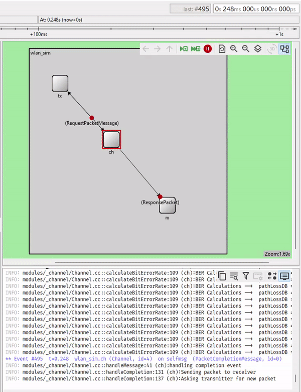
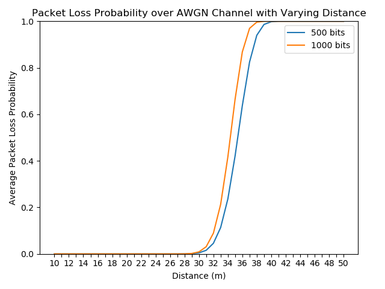
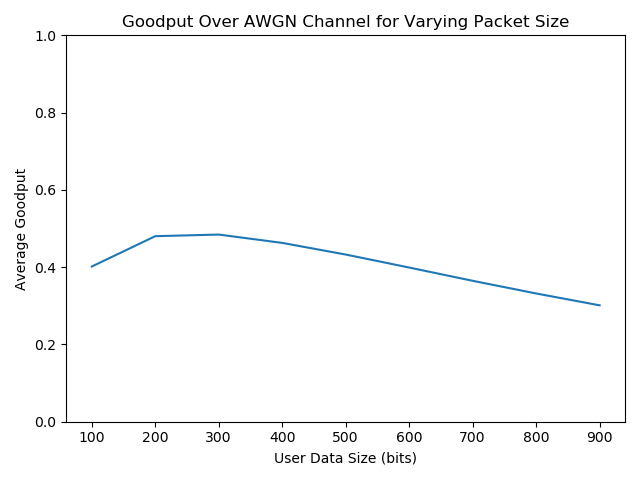
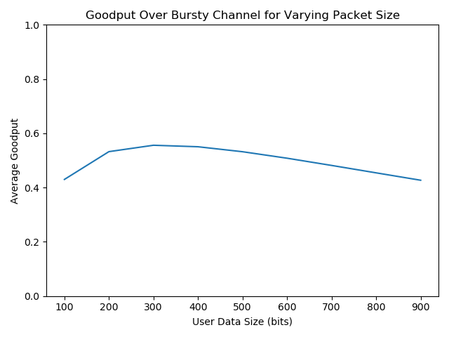

# WLAN Simulation
Wireless network simulation using the [OMNeT++](https://omnetpp.org/) discrete event simulation library and framework.

## Fun Gif


## Simulation

Below are the baseline settings for the WLAN simulation. Each of the scenarios documented below either add to, or override these variables. 
```
network = wlan_sim
sim-time-limit                  = 100s
wlan_sim.ch.pathLossExponent    = 4dBm
wlan_sim.ch.txPowerDBm          = 0dBm
wlan_sim.ch.bitRate             = 250000bps
wlan_sim.ch.noisePowerDBm       = -120dBm
wlan_sim.tx.numberOverheadBits  = 100b
```

### Scenarios
All simulation scenarios can be viewed and tweaked in the `simulations/omnetpp.ini` file. If you would like to alter the topography of the network, you can do so by adding new nodes and connections in the `simulations/packages.ned` file.

#### Bit Error Rate Test
Just a simple test to verify the correctness of the bit error rate (BER) function at a fixed distance.

##### Variables
```
wlan_sim.tx.numberUserBits          = 500b
wlan_sim.ch.nodeDistance            = 50m
wlan_sim.ch.txProbabilityGoodGood   = 0.9999
wlan_sim.ch.txProbabilityBadBad     = 0.9999
wlan_sim.ch.channelGainGoodDB       = 0dB
wlan_sim.ch.channelGainBadDB        = 0dB
````

#### Experiment 1 - AWGN Channel Packet Loss

##### Variables
```
repeat                              = 100
wlan_sim.tx.numberUserBits          = ${400, 900}b
wlan_sim.ch.nodeDistance            = ${10..50 step 1}m
wlan_sim.ch.txProbabilityGoodGood   = 0.9999
wlan_sim.ch.txProbabilityBadBad     = 0.9999
wlan_sim.ch.channelGainGoodDB       = 0dB
wlan_sim.ch.channelGainBadDB 	    = 0dB
```

##### Findings

Packet loss measured over a channel with additive white gaussian noise (AWGN) at varying distances. Figure 1. shows that as the distance between the transmitter and receiver increased, the path loss grew exponentially. It also shows that the packet with 1000 bits experienced higher packet loss at a shorter separation distance when compared to the packet with 500 bits due to its increased packet size. Both curves look very similar to the shape of the complementary error function, as expected.



*Figure 1. Packet loss probability over an AWGN channel at varying distances.*


#### Experiment 2 - AWGN Channel Goodput

##### Variables
```
repeat                              = 100
wlan_sim.tx.numberUserBits          = ${100..900 step 100}b
wlan_sim.ch.nodeDistance            = 35m
wlan_sim.ch.txProbabilityGoodGood   = 0.9999
wlan_sim.ch.txProbabilityBadBad     = 0.9999
wlan_sim.ch.channelGainGoodDB       = 0dB
wlan_sim.ch.channelGainBadDB 	    = 0dB
```

##### Findings

Average goodput (amount of useful information that is successfully delivered, per unit time) measured over an AWGN channel at varying user data (payload) sizes. Figure 2 shows that as the user data size increased, the average goodput reduced, due to the higher probability of any one bit being erroneous.



*Figure 2. Goodput over an AWGN channel at varying user data sizes.*


#### Experiment 3 - Bursty Channel Goodput

##### Variables
```
repeat                              = 100
wlan_sim.tx.numberUserBits          = ${100..900 step 100}b
wlan_sim.ch.nodeDistance            = 35m
wlan_sim.ch.txProbabilityGoodGood   = 0.998
wlan_sim.ch.txProbabilityBadBad     = 0.8802504776808445
wlan_sim.ch.channelGainGoodDB       = 3dB
wlan_sim.ch.channelGainBadDB        = -5dB
```

##### Findings
Average goodput measured over a bursty channel at varying user data (payload) sizes. The findings are very similar to those observed when using an AWGN channel, however, a shallower goodput falloff gradient as user size increases can be observed. This is due to the addition of a markov chain with two positive and negative gains which acted to "smooth" the power of the received signal and improve the likelihood of the channel exiting the bad state. 



*Figure 3. Goodput over a bursty channel at varying user data sizes.*


### Modules

#### Transmitter
The `Transmitter` handles `RequestPacketMessages` sent to it from the `Channel`. When it receives one of these messages, it creates a new `ResponsePacket` to emulate a real packet and sends this to the `Channel`.

#### Channel
The `Channel` facilitates the communication of `ResponsePackets` between the `Transmitter` and the `Recevier`. To kickoff the simulation's packet exchange, the `Channel` sends an initial `RequestPacketMessage` to the `Transmitter` and the `Transmitter` replies by creating and sending back a new `ResponsePacket`. Once the `Channel` receives the `ResponsePacket` from the `Transmitter`, it iterates though the `ResponsePacket's` bits and determines bit-wise if the `ResponsePacket` is to be marked as erroneous. The BER is approximated applying the complementary error function to the received signal-to-noise ratio. A uniform distribution is then randomly sampled, and if this sample is less than the calculated BER, the bit is erroneous and the `ResponsePacket` is marked as such. Some time later, the `ReponsePacket` is then forwarded to the `Receiver` where it is processed further. The exchange then restarts and the `Channel` sends yet another `RequestPacketMessage` to the `Transmitter` for another `ResponsePacket`.
sends both the `PacketCompletionMessage` number of self messages

#### Receiver
The `Receiver` handles `ResponsePackets` sent to it from the `Channel`. When it receives one of these packets it logs statistics about the packet for post-simulation analysis.


### Messages/Packets

#### ResponsePacket
An example packet to be sent from the `Transmitter`, over the `Channel` and delivered to the `Receiver`. It contains a sequence number, some amount of overhead bits (header, trailer), some amount of mock payload bits, an error flag and a bit error count.

#### PacketCompletionMessage
An empty self message, sent by the `Channel` to itself some time in the future to trigger the sending of a new `RequestPacketMessage` to the `Transmitter`.

#### RequestPacketMessage
An empty message, sent by the `Channel` to the `Transmitter` to trigger the creation and sending of a new `ResponsePacket`.
